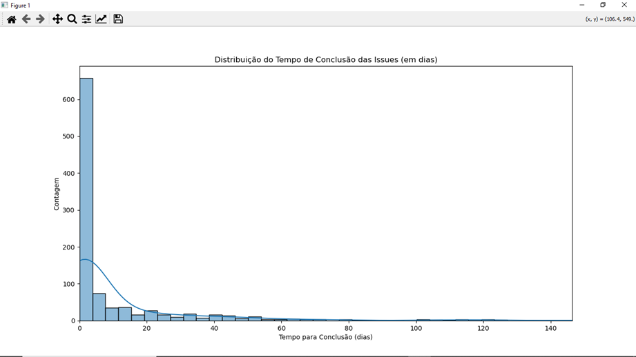
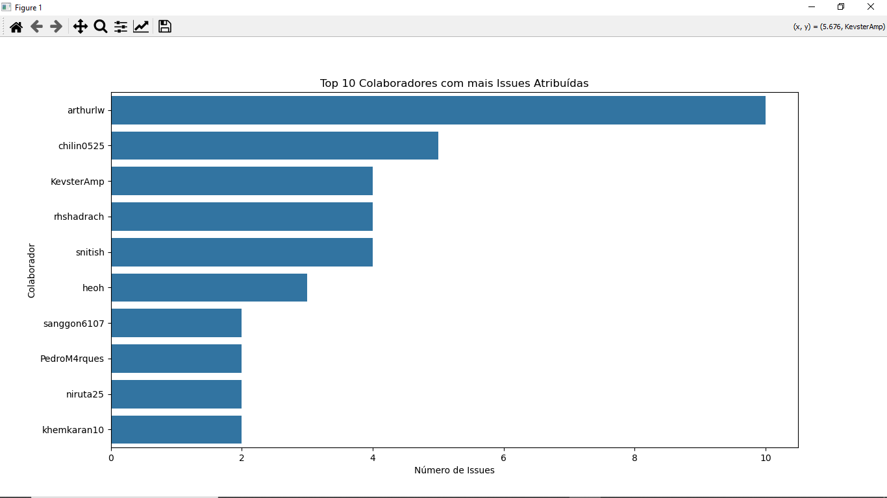

# Relatório de Análise Exploratória de Dados (AED)

## Sumário das Conclusões

### 1. Conclusões sobre a Distribuição do Tempo de Conclusão

- A maioria das issues (aproximadamente 650) é fechada em menos de 10 dias, indicando um alto volume de tarefas rápidas.
- O tempo de conclusão tem uma distribuição "cauda longa", com algumas issues demorando até 192 dias para serem fechadas.
- Hipótese para o modelo: podemos tratar a previsão do tempo de conclusão como um problema de **classificação**, onde a variável alvo é se uma issue será fechada "rápido" (e.g., < 5 dias) ou "lento" (> 5 dias).

### 2. Conclusões sobre os Colaboradores
- A análise dos colaboradores mostra uma distribuição desigual de atribuições.
- Os colaboradores `arthurlw` e `chilin0525` são os mais ativos, lidando com um número significativamente maior de issues.
- A variável `assignee_login` será uma feature muito importante no nosso modelo, pois alguns colaboradores parecem ser mais especializados ou produtivos.

## Próximos Passos
- Prosseguir com a Fase 4: Preparação dos Dados para o Modelo.
- Executar o script `feature_engineering.py` para vetorizar texto e codificar variáveis categóricas.